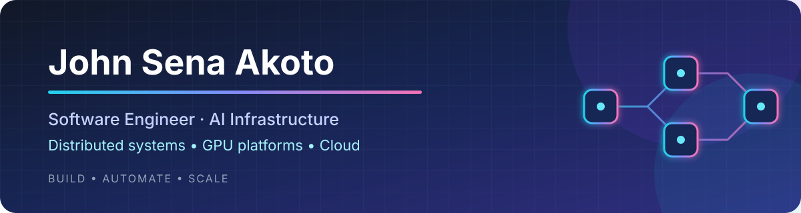
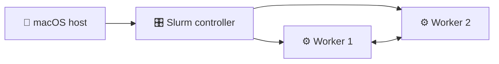

I build software that provisions, validates, and operates cloud and accelerated-computing infrastructure at scale.

## 👋 About me

I'm a Software Engineer at Oracle Cloud Infrastructure working on systems that bring up and operate large-scale AI and GPU infrastructure.

My work spans distributed provisioning, Linux image delivery, Kubernetes-based orchestration, automated remediation, observability, and secure cloud services. I enjoy turning complex infrastructure operations into reliable, measurable, and repeatable software.

Beyond infrastructure engineering, I co-founded Krom Analytics to explore how AI and market intelligence can serve businesses in Ghana's informal economy.

## ⚡ What I work on

- GPU-cluster provisioning and validation
- Distributed systems and infrastructure automation
- Kubernetes, Linux, CI/CD, and cloud platforms
- Production observability and automated remediation
- Secure sovereign-cloud services and migration systems
- Distributed machine-learning infrastructure

## 🚀 Featured project

### [Automated Slurm Cluster Lab](https://github.com/johnsenaakoto/slurm-project)

A fully automated three-node Slurm environment built on Ubuntu ARM64 VMs.

- Multipass VM provisioning
- Cluster networking and time validation
- Shared MUNGE authentication
- Dynamic hardware and IP discovery
- Slurm configuration and daemon management
- Multi-node batch-job validation
- Observable diagnostics and guarded teardown

## 🧰 Selected engineering work

| Project | Focus |
| --- | --- |
| [Slurm Cluster Lab](https://github.com/johnsenaakoto/slurm-project) | HPC scheduling, Linux automation, distributed execution, and operational validation |
| [Secure Messaging Program](https://github.com/johnsenaakoto/Secure-Messaging-Program) | Multithreading, encryption, integrity, confidentiality, and non-repudiation |
| [Music Genre Classification](https://github.com/johnsenaakoto/Music_Genre_Classification) | Applied machine learning and model evaluation |

## 📚 Research

- [Machine Learning vs. Deep Learning for Anomaly Detection and Categorization in Multi-cloud Environments](https://ieeexplore.ieee.org/document/9973112)
- [Observation of stagnant slab material beneath the Aleutian Trench](https://doi.org/10.1093/gji/ggac191)

## 🛠️ Technology

### Languages

### Infrastructure and cloud

### Accelerated computing

## 🎓 Background

I hold master's degrees in Computer Science and Geophysics from Texas Tech University. That combination shapes how I approach engineering: with an interest in both the underlying systems and the real-world problems they serve.

## 🤝 Let's connect

- [LinkedIn](https://www.linkedin.com/in/johnakoto/)
- [Portfolio](https://johnsenaakoto.netlify.app/)
